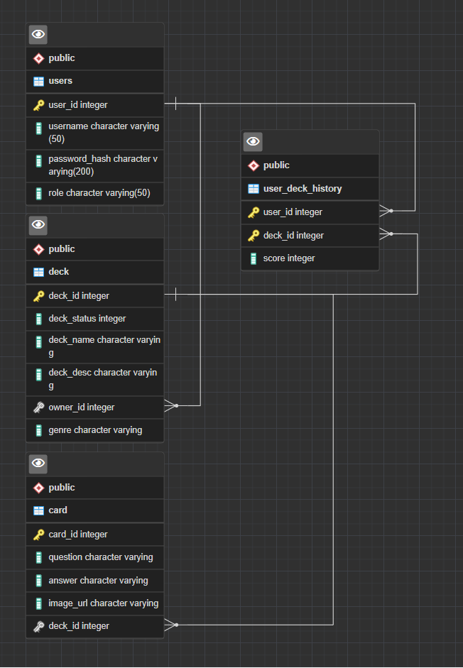

# flashcards
Fullstack web application created for school. I worked with an Agile team
with my classmates and did 'mini-sprints' along with daily stand-ups with a Scrum master,
and a product owner. We utilized Spring Boot and Vue.js for this project, along with the MVC design pattern.

The application, also known as Ninja Flashcards, utilizes a pgAdmin database to keep track
of student's flashcards for studying. You can share flashcards with your friends based off just
the URL if set to public, or you can have flashcard decks for private use.

There is also tracking for your study sessions per user. If you're logged in and complete a study session,
your performance based off the deck will be tracked and saved for a later session.

One to Many

1 user can have many decks

One to Many

1 deck can have multiple cards

Many to Many

Many decks can have a history of many users (user_deck_history merge table)
